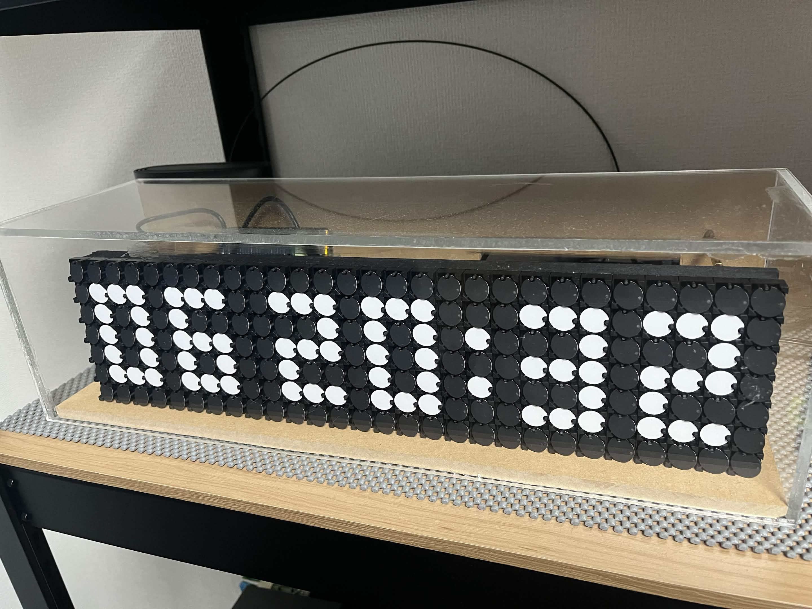
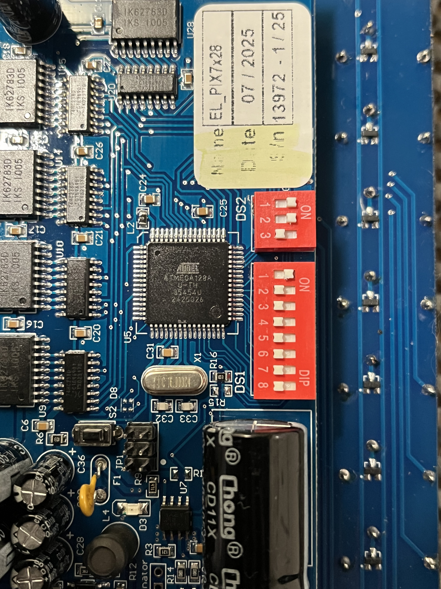
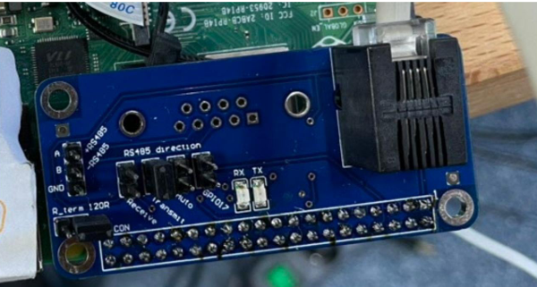

# Flip-Dot-Display Clock

A Raspberry Pi powered clock for the Alfa Zeta XY5 28x7 Flip-Dot Display using RS-485 communication.

## Preview

### Clock Running



The display automatically shows:

```text
DD HH:MM
```

Example:

```text
06 20:45
```

* DD = Day of Month
* HH = Hour (24-hour format)
* MM = Minute

The display updates automatically every minute.

---

## Hardware

### Components

* Alfa Zeta XY5 28x7 Flip-Dot Display
* Raspberry Pi
* RS-485 HAT or USB-to-RS485 Converter
* 24V Power Supply

### Connection Diagram

```text
┌─────────────┐
│ Raspberry Pi│
└──────┬──────┘
       │ UART
       ▼
┌─────────────┐
│ RS-485 HAT  │
└──────┬──────┘
       │ RS-485
       ▼
┌─────────────┐
│ Flip-Dot XY5│
└─────────────┘
```

---

## Environment Setup

### Raspberry Pi OS

Update the system:

```bash
sudo apt update
sudo apt upgrade -y
```

Install Python and pip:

```bash
sudo apt install python3 python3-pip -y
```

Install required Python packages:

```bash
pip3 install pyserial
```

---

## Enable UART

Open Raspberry Pi configuration:

```bash
sudo raspi-config
```

Navigate to:

```text
Interface Options
  └─ Serial Port
```

Configure:

```text
Login shell over serial?  No
Enable serial hardware?   Yes
```

Reboot:

```bash
sudo reboot
```

---

## Run

Execute the clock application:

```bash
python3 clock.py
```

The software reads the Raspberry Pi local system time and updates the display once per minute.

---

## Python Clock Implementation

The included Python script:

* Reads local system time
* Generates 3x5 pixel digits
* Formats the display as DD HH:MM
* Creates a 28-column Flip-Dot frame buffer
* Sends the frame through RS-485 using UART

Communication settings:

```text
Port     : /dev/serial0
Baudrate : 9600
Address  : 0xFF
```

---

## Display Layout

```text
┌────────────────────────────┐
│DD   HH:MM                  │
└────────────────────────────┘
```

Example:

```text
06   20:45
```

---

## DIP Switch Settings

### DIP Switch Settings



### 3-Pin DIP for Baud Rate

The communication transfer speed can be set as follows. Following the settings in the picture, the speed will be 9600.

```plaintext
DIP Switch Position| Baud Rate
-------------------------------
↓ ↓ ↓              | None
↑ ↓ ↓              | None
↓ ↑ ↓              | None
↑ ↑ ↓              | 9600
↓ ↓ ↑              | 19200
↑ ↓ ↑              | 38400
↓ ↑ ↑              | 57600
↑ ↑ ↑              | 9600
```

### 8-Pin DIP for Address

This address ID is used when pushing image data, and each panel listens to the data.

```plaintext
Pin | Description
------------------------------
1-6 | Address in binary code (natural)
7   | Magnetization Time: OFF: 500μs (default), ON: 450μs
8   | Test Mode: ON/OFF. OFF = Normal Operation
```

## Sending Data to the Flipdot Display

To transmit data to the Flipdot Display, an RS-485 interface is required. This can be achieved using either a USB-to-RS-485 converter or an RS-485 HAT (Hardware Attached on Top) for the Raspberry Pi.

### Example Setup:

The following setup uses an RS-485 HAT for seamless integration:



1. Attach the RS-485 HAT to the Raspberry Pi's GPIO pins.
2. Connect the RS-485 output pins to the Flipdot Display's input terminals.
3. Ensure the DIP switch settings match the communication requirements.
4. Provide a 24V power supply to the display.

This setup enables smooth data transmission from the Raspberry Pi to the Flipdot Display using RS-485 protocol.

## Control Instructions

To operate the Alfa Zeta Flip Dot Display XY5 28x7, send serial commands with a structured byte array:

### Command Structure

```python
all_dark = bytearray([
    0x80,
    0x83,
    0xFF,
    0x00, 0x00, 0x00, 0x00, 0x00, 0x00, 0x00,
    0x00, 0x00, 0x00, 0x00, 0x00, 0x00, 0x00,
    0x00, 0x00, 0x00, 0x00, 0x00, 0x00, 0x00,
    0x00, 0x00, 0x00, 0x00, 0x00, 0x00, 0x00,
    0x8F
])
```

* **0x80**: Header byte
* **0x83**: 28 bytes, refresh
* **0xFF**: Address byte
* **0x00 to 0x7F**: 28 bytes of data
* **0x8F**: End of Transmission (EOT)

### Byte Explanation

* **0x00 to 0x7F**: These bytes represent the 28 columns of the 7x28 grid. Each column is represented by a hexadecimal value, with a maximum value of 0x7F (127 in decimal). This value corresponds to the 7 bits of data for that column, with each bit representing the state (on or off) of a dot.

For example, the binary value `1111111` translates to the hexadecimal value `0x7F`, indicating that all seven dots in the column should be on.
